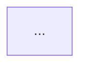

# exec: draft-ux

> CC 加载本文时，当前任务是从 PRD 功能出发，通过三层递进确认本期核心交互逻辑，输出流程图和可点击 HTML 原型，为 TRD 提供业务依据。
> 三层顺序：**场景枚举**（穷举用户视角的业务流）→ **流程图**（可视化分支与路径）→ **HTML 原型**（让每条路径可实际走通）

**上下文密度**：中低。以产物为驱动，轮次较少但单轮产出较重。关键节点阻断等待用户确认。

---

## 红线

- **禁止从画面入手**：不先画界面，先列场景；场景未确认前不绘流程图
- **禁止只覆盖主路径**：所有替代路径（用户选择不同操作 / 不同入口）都必须出现在场景列表中
- **禁止死路**：流程图中每条分支必须有明确去向，没有"？"或空白出口
- **禁止系统内部逻辑混入**：场景和流程图只描述用户可见的操作与反馈，后端校验逻辑不出现在本产物中
- **禁止跳层**：场景未确认不进流程图，流程图未通过死路检查不进原型

---

> **步骤协议**：每步完成后输出 `✅ [步骤名] 完成：[2–3 句结论] → 下一步：[步骤名] — [一句说明] 继续？`；🚫 处必须等用户明确回应才继续。

---

## 会话启动

**第一步：读上下文**：

```
Read: iterations/vN/prd.md
Read: design.md（如存在，用于了解视觉风格，不强制）
```

**第二步：状态判断**：

| 观察到的状态 | 处理方式 |
|-------------|---------|
| `ux-flows.md` 不存在 | 从 Step 1 开始 |
| `ux-flows.md` 存在，无流程图 | 从 Step 2 开始，场景已有 |
| `ux-flows.md` 存在，有流程图 | 从 Step 3 开始，读已有产物接续 |
| `prototype.html` 存在 | 确认是否需要修订，否则任务已完成 |

开场说：「本次任务是完成 v{N} 交互原型。我会分三层推进：先枚举业务场景，再绘制流程图，最后输出可走通的 HTML 原型。」

---

## 第一层：场景枚举

### Step 1：从 PRD 功能逐一拆场景

读 `iterations/vN/prd.md`，针对每个功能，枚举该功能涉及的所有用户业务流。

**每条场景格式**（严格一句话）：
```
用户从 [入口/前置状态]，执行 [操作]，到达 [结果/去向]。
```

**枚举要求**：
- 每个功能至少覆盖：主成功路径 + 所有用户可主动选择的替代路径
- 入口：用户从哪里进来（首页入口 / 其他页面跳转 / 直接访问链接等）
- 操作：用户做了什么（点击 / 填写 / 选择 / 取消等）
- 去向：用户最终到了哪里（新页面 / 原页面状态变更 / 流程结束等）

**输出格式**：

```markdown
## 场景列表 · v{N}

### 功能：{功能名}
- 场景 A：用户从 {入口}，执行 {操作}，到达 {去向}。
- 场景 B：用户从 {入口}，执行 {操作}，到达 {去向}。
- 场景 C：...

### 功能：{功能名}
- 场景 D：...
```

**自检**：列完后检查：
- 每个 PRD 功能都有对应场景？
- 有没有"只有主路径、没有替代路径"的功能（如有，补齐）？
- 场景之间有没有入口或去向相互引用的情况（如有，标注）？

🚫 等用户确认场景列表完整、无遗漏

---

## 第二层：流程图

### Step 2：绘制 mermaid 流程图

将场景列表转换为可视化流程图，重点是**分支和路径**。

**节点类型约定**：
```
[入口/页面] —— 矩形，用户所在位置
(操作) —— 圆角矩形，用户的主动动作
{决策点} —— 菱形，用户有不同选择的地方
((结束)) —— 双圆，流程终点
```

**流程图要求**：
- 每个场景都有对应路径
- 相同入口/页面合并为同一节点（不重复画）
- 每个决策点必须列出所有分支，每条分支必须有明确终点
- 禁止悬空箭头或指向空白

**输出格式**：

````markdown
## 流程图 · v{N}


````

**死路检查**（写完流程图后自行执行）：
- 遍历每条分支，确认终点是"结束节点"或"已有页面节点"，不是空白
- 如有死路，补全后再输出

🚫 等用户确认流程图无遗漏、无死路

---

## 第三层：HTML 原型

### Step 3：生成自包含 HTML 原型

将流程图中每一条路径实现为可点击的页面导航。

**实现要求**：

| 要求 | 说明 |
|------|------|
| 自包含 | 单个 `.html` 文件，CSS/JS 全部内联，无任何外部依赖 |
| 路径可达 | 流程图中每条路径都能从入口点击到终点，不卡死 |
| 状态可见 | 每个页面/状态显示：当前位置（面包屑或页面标题）+ 可执行操作（按钮/链接） |
| 不需要真实数据 | 占位内容即可（如"用户名""任务标题"等），重点是导航逻辑正确 |
| 轻量 | 不追求视觉精美，追求逻辑完整；样式保持最小可读即可 |

**页面结构模板**（每个状态/页面参考）：
```html
<!-- 当前位置：{页面名} -->
<h2>{页面标题}</h2>
<p>{页面简述：用户在这里可以做什么}</p>
<div class="actions">
  <a href="#{目标状态id}">{操作按钮文字}</a>
  <a href="#{另一个目标状态id}">{另一操作}</a>
</div>
```

**写完后自检**：
- 在浏览器打开，遍历流程图中每条路径，确认全程可点击走通
- 检查有无点击后无反应或跳转到空白锚点的情况

输出文件：`iterations/vN/prototype.html`

🚫 等用户实际打开原型、走一遍主要路径后确认逻辑正确

---

## 收尾

### Step 4：写文件 + 移交

将场景列表和流程图写入 `iterations/vN/ux-flows.md`，HTML 原型写入 `iterations/vN/prototype.html`。

```
✅ draft-ux v{N} 完成：{功能数} 个功能，{场景数} 条场景，{路径数} 条流程路径，原型全路径可走通。
```

执行：
```bash
git add iterations/vN/ux-flows.md iterations/vN/prototype.html
git commit -m "feat(ux): v{N} 交互流程图 + 原型 [{项目名}]"
```

移交：「交互原型完成，下一步 `draft-tech-design`。TRD 接口设计时请参考 `ux-flows.md` 流程图和 `prototype.html` 确认前端数据需求。」

---

## 边界场景

| 场景 | 处理方式 |
|------|---------|
| PRD 某功能描述过于模糊，无法拆场景 | 阻断，列出具体问题，要求用户先明确该功能再继续 |
| 流程图分支极多，mermaid 渲染混乱 | 拆为多张子图（按功能分），分别在 `ux-flows.md` 中呈现 |
| 用户要求加视觉样式 | 可加，但不得以此为由推迟路径覆盖；先走通路径，再加样式 |
| 用户认为某条场景不需要原型覆盖 | 在场景列表中标注"[跳过原型]"并注明原因，流程图中保留该路径 |
| 走通过程中发现 PRD 有逻辑矛盾 | 暂停，列出矛盾点，询问用户决策，不擅自取舍 |

---

## Subagent 使用

无。场景枚举和流程图是对话推进，HTML 原型由 CC 直接生成，不需要 subagent。

---

## 上下文管理

- 上下文密度低，一般不需要 compact
- 如场景数量超过 20 条、对话轮次过多，在流程图确认后（Step 2 结束、Step 3 开始前）做一次 compact，compact 前将 `ux-flows.md` 写入磁盘作为断点
