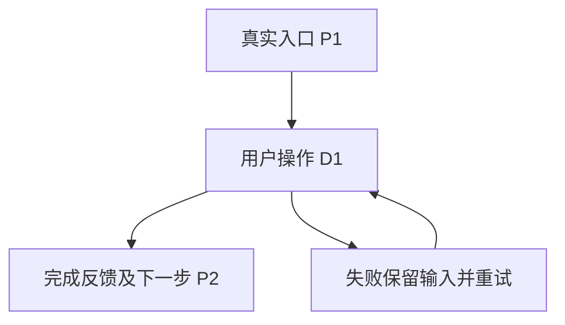

# exec: draft-ux

从已确认 PRD 出发，以用户要完成的任务组织完整动线，再安排页面与控件。用户任务不是开发任务包，也不必与功能或页面一一对应。交付沿用 ux-flows.md、prototype.html、prototype-map.md 与 design.md。

## 完成标准与边界

- 每个核心用户目标有明确起点、必要信息、关键判断、结果与完成反馈；一条任务可以跨多个功能/页面。
- 相关的失败、取消、返回、未保存离开和中断恢复有可用出口，跨页保留必要输入、选择和上下文。
- PRD AC 反向查漏；不能把“功能都有按钮”当作任务已完成。用户任务不增加 PRD 之外的业务承诺。
- 不穷举所有点击排列；覆盖不同业务决策、终态与恢复行为。视觉以已确认 design 为准，改变业务/关键交互方向先让用户决定。
- 原型是可操作的行为模拟，不声明已经实现后端或外部副作用。浏览器未运行、任务未走通或用户未接受时不得报告 UX 完成。

## 启动与恢复

读本期 prd.md、现有 ux-flows/prototype-map、design 全局基线及相关页面；缺失才补问，已有结论不重复访谈。G1 未签先完成 PRD。用户指定任务后直接处理，不为选择工作方式单独等待。
- 尚无动线：从 Step 1 开始。
- 有动线、无原型：按现有决定继续 Step 3。
- 有原型但映射/证据缺失：回读 PRD 和用户任务补齐，实际运行 Step 4，不能事后按 HTML 反推完整性。
- 有用户接受记录：核其对应的原型版本；未改变则收尾，变更涉及的任务重新走查。
压缩/中断后从原始决定、文件与证据恢复；不从摘要猜用户接受，不在固定步骤强制 compact。

## Step 1：明确用户任务与设计约束

先回答：谁在什么情境下、为得到什么结果而使用系统？他从哪里开始、已知道什么、需要判断什么、怎样知道做完？使用用户语言命名任务，如“确认这批材料能否提交”，而不是“管理列表/编辑详情”。

从 PRD 和已有信息提取核心任务；只把真正缺失的业务条件或会改变动线的取舍交给用户。需要比较方案时给少量可操作原型或简洁路径说明；用户要求看过程图时可以展示，不强制隐藏。

已有全局视觉基线沿用；缺失时只确认必要基调。页面清单在任务动线形成后确定，不按功能表先建同名页面。重大信息架构/交互取舍需确认，普通控件选择自主完成。单期决定写 ux-flows 对应任务；长期取舍写 decisions。

## Step 2：先写完整动线与界面地图，再布置画面

在 `iterations/vN/ux-flows.md` 写三段，供原型、TRD 和后续验证共用：

````markdown
# UX Flows · vN

## 场景列表

### 用户任务：U1 提交材料并确认结果
- 目标：用户要得到的业务结果
- 起点：触发情境、真实入口与已有数据
- 完成：可观察的结果及反馈；做完后可去哪里
- 相关功能：PRD 功能名称（可多个）
- S1：主路径；从入口准备信息、判断、操作到达完成结果
- S2：提交失败后保留输入，修正或重试并回到任务
- S3：取消/返回与中断恢复；说明哪些状态保留或丢弃
- 关键取舍：只记实际发生的决定、前提和理由；无则省略

### 用户任务：U2 ...
...

## 动线—界面地图
| 位置 | 形态与名称 | 承接任务/场景 | 打开来源 | 完成/返回位置 |
|---|---|---|---|---|
| P1 | 页面·材料工作台 | U1/S1 | 业务导航 | D1 |
| D1 | 弹层·提交材料 | U1/S1、S2、S3 | P1 | P1（取消）、P2（完成） |
| P2 | 页面·处理结果 | U1/S1、S2 | D1 | P1 |

## 流程图

````

表中示例必须替换。位置 ID 在本期唯一且稳定：`P` 页面、`D` 弹层、`A` 抽屉、`I` 页面内区域；弹层/抽屉/内联结构须写所属页面或打开来源，不把它们伪装成独立页面。每个 S-id 至少落到一个位置；共用组件的不同模式仍分别写清起点、作用对象和返回位置。U-id/S-id 同样不因改名重排；复杂图按用户任务拆，不按组件拆。

界面地图不是把已有页面清单换成表格。先用动线作以下判断：

- 主入口的名称是否直接表达用户动作和对象；主任务完成后落到哪里，和“接下来可选做什么”分开，未经确认不自动打开任一子对象。
- 新建与补充、首次与再次等模式即使复用同一组件，也不混淆结果所属对象、取消去向和完成后的返回位置。
- 必须保留当前对象、版本、坐标等上下文的查看/定位动作，优先留在当前页面或其局部界面；低频维护、历史和确认分支不抬成主流程页面。
- 若动线回答了对象何时创建、全失败是否留空对象、部分成功如何保留/重试、是否自动选择子对象等用户可观察的业务规则，而 PRD AC 尚未规定，先走 `revise-doc(target=prd)` 补回契约，再继续；不能只把新承诺藏在 UX 文件里。

逐个步骤核：用户是否知道下一步；信息是否在做决定之前出现；是否重复输入、无谓跳转、丢失上下文；完成反馈是否对应真实结果。基于此安排页面/抽屉/内联结构，而非为每个功能制造一个入口。

界面地图中只有会改变业务规则、主入口、完成落点或关键上下文的未决取舍才交用户确认；普通界面归属自主完成。未决关键取舍关闭前暂停原型，不用已画页面反推或逼迫动线。

## Step 3：生成连贯的可交互原型

动线—界面地图完成且关键取舍关闭后，默认在本会话生成自包含 HTML（CSS/JS 内联），多画面保持同一份模拟数据和状态。使用真实感但虚构的场景数据，模拟失败、重试和恢复；不得调用生产服务或产生真实副作用。状态转换必须反映用户操作，不允许所有按钮都只弹“成功”。

沿用 design token；补本轮真实页面的稳定标题和当前布局/状态约定，先标为待用户走查。一个页面可承接多个功能，一个任务也可跨页。不要预先锁成“每功能一页”。

用户明确要求外部设计会话时才读取 `draft-ux-external.md`。无论来源，带回原型后都运行同一验证流程；单一检出中的修复由当前责任方执行，避免两份原型同时修改。

同时写 `prototype-map.md`：

````markdown
## 前端 AC 覆盖
| AC | 用户任务 | 场景 | HTML 锚点 | 页面规格 |
|---|---|---|---|---|
| AC-01 | U1 | S1、S2 | #entry、#result | 工作台、结果页 |

## 排除 AC
| AC | 排除原因 |
|---|---|
| AC-02 | 纯数据约束，无用户可见交互 |

## 动线验证
| 场景 | 结果 | 证据 |
|---|---|---|
| S1 | 通过 | iterations/vN/ux-evidence/S1.txt |
| S2 | 未运行 | 浏览器能力缺失 |
````

表中示例必须替换。所有 PRD AC 恰好出现在覆盖或排除的一侧；允许同一前端 AC 多行承接不同场景。页面规格列用 design 中的真实页面标题，多个值用“、”分隔。不能把后端排除作为遗漏用户任务的出口。

## Step 4：AI 实际走查与修复

用当前 Codex 可用浏览器工具打开原型，从真实入口按用户目标执行。逐场景核状态、数据和任务结果；检查关键焦点/反馈及相关视口。恢复场景实际离开或重载后核数据，不只看按钮事件或隐藏节点。

证据写 `iterations/vN/ux-evidence/{S-id}.txt`（或对应截图/录屏），包含原型 Git 版本或内容哈希、前置数据、实际动作、可观察结果、失败/未运行原因；日志和截图去敏。prototype-map 只索引证据，不复制整份报告。

发现范围内死路、状态丢失、无反馈或重复操作则直接修复并重跑受影响场景。新业务取舍才询问用户。修改原型后核证据有效性，不能沿用改前版本的通过结论。

运行 `node ../hact-method-lab/templates/scripts/check-ux.js vN .` 核引用/AC 完备/证据文件。它只检结构与证据索引，不证明体验正确；浏览器能力不可用时记录未完成，不把技术验证转嫁成用户的找错任务。

## Step 5：独立任务走查

用不继承设计叙事的 Codex 子代理（本接口 `fork_turns="none"`），按 `../hact-method-lab/templates/review-briefs/prototype-review.md` 自读 PRD、用户任务动线、原型与证据。核遗漏目标、真实可达性、信息顺序及恢复；不能只核 map 自报的锚点。

独审发现范围内问题，由主线修复并定向复审；不逐 finding 让用户选择是否修 bug。涉及产品取舍或必要能力缺失则明确暂停。通过后进入用户体验走查。

## Step 6：用户按任务验收

交付原型时提供每个核心任务的情境、起点与预期结果，让用户自然完成，不给逐按钮教学掩盖发现性问题。用户评价是否符合真实工作、信息是否足够、路径是否顺手；技术死路应已由 AI 先处理。

反馈分成范围内修复和会改变已确认方向的取舍，前者自动处理；改动后重走受影响任务。只有用户明确接受且对应版本未失效才完成。接受证据写在 prototype-map「用户确认」一段，注明用户回应与原型版本；不能自行生成用户同意。

## Step 7：收尾与下游承接

用户接受后，将 design 对应页面更新为已确认规格；ux-flows、prototype-map 与原型保持同版。将本次变更及已有证据一起提交；不新增重复规格或另签 UX Gate。

向 draft-tech-design 移交 U-id/S-id、任务结果、必要失败/恢复行为与页面映射。接口/状态/数据设计必须承接整条用户任务；任务包 reference 引用对应动线，集成与验收复用它验证真实系统。

完成声明只报告：已完成的用户任务、已验证分支、用户确认版本与遗留项。不以功能数、按钮数或锚点存在代替任务完成。
